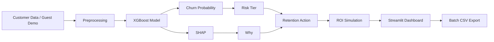

# 📉 Customer Churn Prediction Action System

### Predict Risk → Explain Why → Recommend Action → Measure Impact

An end-to-end, action-oriented customer churn system built with **Python, XGBoost, SHAP and Streamlit**. It identifies high-risk customers, explains the drivers, recommends retention actions, and estimates the financial value of intervention.

## 🚀 Live Demo

**Streamlit:** https://customer-churn-prediction-action-system-piyu.streamlit.app/

### 👤 Guest Demo Mode

Open the live app and select **Guest Demo** to explore the full product without uploading a file.

- Synthetic customer data is generated locally in the app.
- No real customer information is required.
- All major dashboard functions are enabled.
- Switch to **Upload Dataset** when you want to score your own CSV.

## ✨ Product Workflow

```text
Customer Data / Guest Demo
          ↓
   Churn Probability
          ↓
    Risk Segmentation
          ↓
    SHAP Explanation
          ↓
    Retention Action
          ↓
      ROI Simulation
          ↓
    Business Decision
```

## 🎯 Core Features

| Feature | What it does |
|---|---|
| 👤 Guest Demo | Fully functional synthetic-data demo for recruiters and visitors |
| 🤖 XGBoost Churn Prediction | Estimates customer churn probability |
| 👤 Customer 360 | Combines profile, risk, drivers and recommended action |
| 🧠 SHAP Explainability | Shows global and customer-level churn drivers |
| 🎯 Threshold Optimization | Lets users choose an intervention threshold |
| 📊 Model Comparison | Compares Logistic Regression, Random Forest and XGBoost |
| 📦 Batch Scoring | Scores customer files and exports predictions as CSV |
| 🔬 What-if Simulator | Tests how changing customer attributes affects churn risk |
| 💰 ROI Simulator | Estimates saved revenue, intervention cost, net value and ROI |
| 🛡️ Model Monitoring | Detects feature-distribution shifts against reference data |
| 📈 Risk Analytics | High/medium/low segmentation and risk distributions |

## 🧠 Explainable AI

For each customer, the system provides:

- Churn probability
- Risk tier
- Top churn driver
- SHAP feature impacts
- Recommended retention action

Positive SHAP values push the prediction toward churn; negative values push it away from churn.

## 💼 Retention Action Engine

```text
Pricing / Charges  → Targeted pricing incentive
Contract           → Long-term contract offer
Support / Tech     → Proactive support outreach
Engagement         → Targeted engagement campaign
Revenue / Profit   → Account review
```

This creates a **Predict → Explain → Act** workflow rather than a prediction-only model.

## 💰 Business ROI

**Expected Value Saved = Revenue at Risk × Expected Save Rate**

**Net Value = Expected Value Saved − Intervention Cost**

**ROI = Net Value ÷ Intervention Cost × 100**

## 📊 Model Evaluation

The training pipeline compares Logistic Regression, Random Forest and XGBoost using Accuracy, Precision, Recall, F1 and ROC-AUC. The repository also contains evaluation charts for deeper analysis.

## 🛡️ Monitoring

The dashboard includes a lightweight standardized mean-shift monitor. Uploaded datasets are compared against the repository reference data; Guest Demo data is synthetic.

Production extensions can include PSI/KS tests, missing-value monitoring, delayed labels, live performance tracking and automated drift alerts.

## 🏗️ Architecture


```mermaid
graph LR
    D[Customer Data / Guest Demo] --> P[Preprocessing]
    P --> M[XGBoost Model]
    M --> R[Churn Probability]
    M --> S[SHAP]
    R --> T[Risk Tier]
    S --> W[Why]
    T --> A[Retention Action]
    W --> A
    A --> ROI[ROI Simulation]
    ROI --> UI[Streamlit Dashboard]
    UI --> CSV[Batch CSV Export]
```

## 📁 Project Structure

```text
app/
└── main.py                 # Streamlit product dashboard + Guest Demo
src/
├── retention.py            # Retention rules + ROI logic
├── train_dashboard.py      # Model training and comparison
├── explainability.py       # Explainability utilities
├── data_drift.py           # Drift utilities
├── baseline_comparison.py  # Baseline model analysis
└── model/                  # ML pipeline/evaluation
models/                     # Trained model artifacts
data/                       # Dataset and database
notebooks/                  # Experiments and analysis
Assets/                     # Evaluation charts
Screenshot/                 # Product/workflow visuals
tests/                     # Automated tests
Dockerfile
Makefile
requirements.txt
README.md
```

## 🚀 Run Locally

```bash
git clone https://github.com/Piyu242005/Customer-Churn-Prediction-Action-System.git
cd Customer-Churn-Prediction-Action-System
pip install -r requirements.txt
streamlit run app/main.py
```

## 🔐 Data & Security

Use synthetic or anonymized data for public demos. Do not upload sensitive customer information to a public deployment. Production use should add authentication, authorization, encryption, audit logging and appropriate data-retention controls.

## 🗺️ Next Improvements

- [ ] Probability calibration
- [ ] Retention A/B testing
- [ ] Uplift modeling
- [ ] Automated drift alerts
- [ ] Scheduled model retraining

> **Note:** The application intentionally remains Streamlit-based; no FastAPI prediction layer is included.

## 👨‍💻 Author

**Piyush Ramteke** — Data Scientist | AI/ML Engineer

GitHub: https://github.com/Piyu242005
