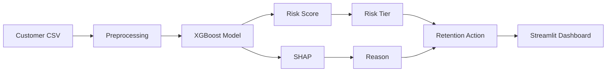

# 📉 Customer Churn Prediction Action System

### Predict Risk → Explain Why → Recommend Action

An end-to-end ML application that predicts customer churn, explains the drivers behind each prediction with **SHAP**, and converts risk into practical retention recommendations.

> **Purpose:** I created this project to demonstrate the full path from a machine-learning prediction to a business decision: identify at-risk customers, understand the reason, and recommend an action.

## ✨ Workflow

```text
Customer Data
     ↓
Churn Probability
     ↓
Risk Segmentation
     ↓
SHAP Explanation
     ↓
Retention Recommendation
     ↓
Business Dashboard
```

## 🎯 Core Features

| Feature | Business value |
|---|---|
| XGBoost Churn Prediction | Estimates continuous churn probability |
| Risk Segmentation | Prioritizes low/medium/high-risk customers |
| SHAP Explainability | Identifies individual churn drivers |
| Action Recommender | Converts model output into retention tasks |
| Streamlit Dashboard | Makes results accessible to business users |

## 🏗️ Architecture


```mermaid
graph LR
    D[Customer CSV] --> P[Preprocessing]
    P --> M[XGBoost Model]
    M --> R[Risk Score]
    M --> S[SHAP]
    R --> A[Risk Tier]
    S --> WHY[Reason]
    A --> ACT[Retention Action]
    WHY --> ACT
    ACT --> UI[Streamlit Dashboard]
```

## 📊 Evaluation

The project compares ML approaches and uses XGBoost as the primary model. Evaluation should be interpreted using the current training run rather than treating a historical README percentage as a permanent guarantee.

Recommended metrics:

**ROC-AUC · PR-AUC · Precision · Recall · F1 · Confusion Matrix · Calibration**

## 🚀 Run Locally

```bash
git clone https://github.com/Piyu242005/Customer-Churn-Prediction-Action-System.git
cd Customer-Churn-Prediction-Action-System
pip install -r requirements.txt
streamlit run app/main.py
```

Sample data is available in the repository's screenshot/sample-data directory.

## 📁 Structure

```text
app/          # Streamlit UI
src/          # Training, preprocessing and evaluation
models/       # ML artifacts
data/         # Data files/notebooks/     # Analysis
Screenshot/   # Demo images and sample data
tests/        # Automated tests
requirements.txt
Makefile
README.md
```

## 🔐 Data & Security

Do not upload sensitive customer information to a public deployment. Real production use should add authentication, authorization, encryption, audit logging and appropriate data-retention controls.

## 🗺️ Roadmap

- [ ] FastAPI prediction service
- [ ] Cloud deployment
- [ ] Action A/B testing
- [ ] Probability calibration
- [ ] Model drift monitoring
- [ ] Retention uplift modeling

## 👨‍💻 Author

**Piyush Ramteke** — Data Scientist | AI/ML Engineer

GitHub: https://github.com/Piyu242005
