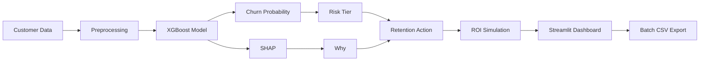

# 📉 Customer Churn Prediction Action System

### Predict Risk → Explain Why → Recommend Action → Measure Impact

An end-to-end, action-oriented customer churn system built with **Python, XGBoost, SHAP and Streamlit**. It moves beyond prediction by identifying high-risk customers, explaining the drivers, recommending retention actions, and estimating the financial value of intervention.

> **Purpose:** Demonstrate the complete path from machine-learning prediction to a practical customer-retention decision.

## 🚀 Live Demo

**Streamlit:** https://customer-churn-prediction-action-system-piyu.streamlit.app/

## ✨ Product Workflow

```text
Customer Data
     ↓
Churn Probability
     ↓
Risk Segmentation
     ↓
SHAP Explanation
     ↓
Retention Action
     ↓
ROI Simulation
     ↓
Business Decision
```

## 🎯 Core Features

| Feature | What it does |
|---|---|
| 🤖 XGBoost Churn Prediction | Estimates customer churn probability |
| 👤 Customer 360 | Combines customer profile, risk, drivers and recommended action |
| 🧠 SHAP Explainability | Shows global and customer-level churn drivers |
| 🎯 Threshold Optimization | Lets business users choose an intervention threshold |
| 📊 Model Comparison | Compares Logistic Regression, Random Forest and XGBoost |
| 📦 Batch Scoring | Scores uploaded customer files and exports predictions as CSV |
| 🔬 What-if Simulator | Tests how changing customer attributes affects churn risk |
| 💰 ROI Simulator | Estimates saved revenue, intervention cost, net value and ROI |
| 🛡️ Model Monitoring | Detects feature-distribution shifts against reference data |
| 📈 Risk Analytics | High/medium/low segmentation and risk distributions |
| 🎬 Streamlit Dashboard | Interactive business-facing interface |

## 🧠 Explainable AI

For each customer, the system provides:

- Churn probability
- Risk tier
- Top churn driver
- SHAP feature impacts
- Recommended retention action

Positive SHAP values push the prediction toward churn; negative values push it away from churn.

## 💼 Retention Action Engine

The recommendation layer maps model drivers to practical business actions, for example:

```text
Pricing / Charges  → Targeted pricing incentive
Contract           → Long-term contract offer
Support / Tech     → Proactive support outreach
Engagement         → Targeted engagement campaign
Revenue / Profit   → Account review
```

This creates a **Predict → Explain → Act** workflow rather than a prediction-only model.

## 💰 Business ROI

The ROI simulator estimates:

**Expected Value Saved = Revenue at Risk × Expected Save Rate**

**Net Value = Expected Value Saved − Intervention Cost**

**ROI = Net Value ÷ Intervention Cost × 100**

This allows users to test whether a retention campaign is economically worthwhile.

## 📊 Model Evaluation

The training pipeline compares:

- Logistic Regression
- Random Forest
- XGBoost

Metrics include:

**Accuracy · Precision · Recall · F1 · ROC-AUC · PR-AUC · Confusion Matrix · Calibration**

The dashboard also includes threshold analysis and visual evaluation assets.

## 🛡️ Monitoring

The dashboard includes a lightweight feature-drift monitor based on standardized mean shift between reference and current data.

For production environments, this should be extended with:

- PSI / KS tests
- Missing-value monitoring
- Prediction-distribution monitoring
- Delayed-label monitoring
- Live performance tracking
- Model drift alerts

## 🏗️ Architecture


```mermaid
graph LR
    D[Customer Data] --> P[Preprocessing]
    P --> M[XGBoost Model]
    M --> R[Churn Probability]
    M --> S[SHAP]
    R --> T[Risk Tier]
    S --> W[Why]
    T --> A[Retention Action]
    W --> A
    A --> ROI[ROI Simulation]
    ROI --> UI[Streamlit Dashboard]
    UI --> CSV[Batch CSV Export]
```

## 📁 Project Structure

```text
app/
└── main.py                 # Streamlit product dashboard

src/
├── retention.py            # Retention rules + ROI logic
├── train_dashboard.py      # Model training and comparison
├── explainability.py        # Explainability utilities
├── data_drift.py            # Drift utilities
├── baseline_comparison.py   # Baseline model analysis
├── model/                   # ML pipeline/evaluation
└── ...

models/                     # Trained model artifacts
data/                       # Dataset and database
notebooks/                  # Experiments and analysis
Assets/                     # Evaluation charts
Screenshot/                 # Product/workflow visuals
tests/                     # Automated tests
Dockerfile
Makefile
requirements.txt
README.md
```

## 🚀 Run Locally

```bash
git clone https://github.com/Piyu242005/Customer-Churn-Prediction-Action-System.git
cd Customer-Churn-Prediction-Action-System
pip install -r requirements.txt
streamlit run app/main.py
```

## 🔐 Data & Security

Do not upload sensitive customer information to a public deployment. Production use should add authentication, authorization, encryption, audit logging, and appropriate data-retention controls.

## 🗺️ Next Improvements

- [ ] Probability calibration
- [ ] Retention A/B testing
- [ ] Uplift modeling
- [ ] Automated drift alerts
- [ ] Scheduled model retraining

> **Note:** This version intentionally keeps the application Streamlit-based and does not add a FastAPI prediction layer.

## 👨‍💻 Author

**Piyush Ramteke** — Data Scientist | AI/ML Engineer

GitHub: https://github.com/Piyu242005
